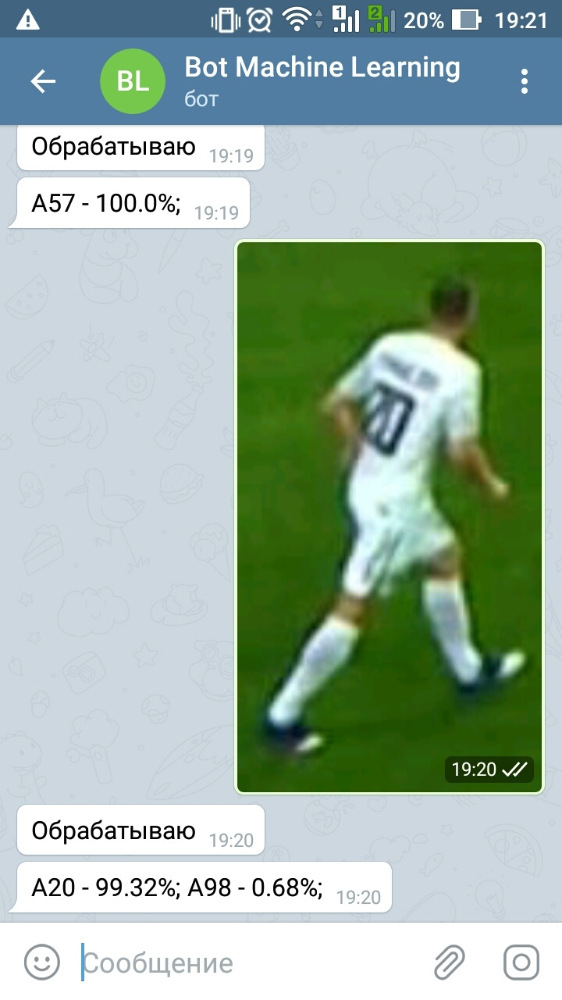

#  Bot_ML

## Для решения этой задачи была применена сверточная нейросеть, архитектура которой представлена ниже
```
_________________________________________________________________
Model: "sequential"
_________________________________________________________________
Layer (type)                 Output Shape              Param #   
=================================================================
conv2d (Conv2D)              (None, 44, 44, 128)       18944     
_________________________________________________________________
max_pooling2d (MaxPooling2D) (None, 22, 22, 128)       0         
_________________________________________________________________
conv2d_1 (Conv2D)            (None, 18, 18, 256)       819456    
_________________________________________________________________
max_pooling2d_1 (MaxPooling2 (None, 9, 9, 256)         0         
_________________________________________________________________
conv2d_2 (Conv2D)            (None, 7, 7, 128)         295040    
_________________________________________________________________
max_pooling2d_2 (MaxPooling2 (None, 3, 3, 128)         0         
_________________________________________________________________
conv2d_3 (Conv2D)            (None, 1, 1, 64)          73792     
_________________________________________________________________
flatten (Flatten)            (None, 64)                0         
_________________________________________________________________
dense (Dense)                (None, 512)               33280     
_________________________________________________________________
dense_1 (Dense)              (None, 512)               262656    
_________________________________________________________________
dense_2 (Dense)              (None, 128)               65664     
_________________________________________________________________
dropout (Dropout)            (None, 128)               0         
_________________________________________________________________
dense_3 (Dense)              (None, 25)                3225      
=================================================================
Total params: 1,572,057
Trainable params: 1,572,057
Non-trainable params: 0
_________________________________________________________________

```

## Запуск бота
```
python3 main.py --token 'your_token'
```
## Cсылка
[Bot Machine Learning](https://t.me/ML_123_bot)

## Пример работы бота

